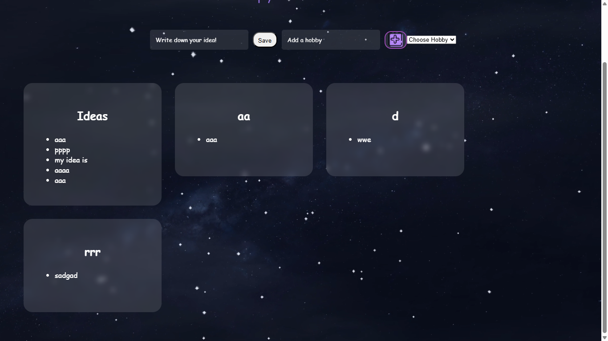

4 renamed my folder and removed nested folder. tried to set up firebase. authentication done.
5 commented out all firebase to do it after home page is done,created home page, sketched html
6 drop down list added, tried to make cards and dynamic website
7 hobbies section successfully added. set idea as default and cards generated
8 fixed overlapping css + added css on cards
9 added more css
11 linked cards to a new page, re-setup firebase auth
12 login auth setup + firestore setup + storing ideas in firestore, loading & connecting ideas in home page. and lots of testing
solved a problem : ideas do not disappear even after page reloads

problem : everyone can see everyones ideas.
13 test query, new page for cards created and linked firestore to extracted every ser's respective idea. 
14 linked list view page, there was a problem, the ideas were loading even after page refresh but hobbies were disappearing. fixed it with new if loop for hobbies, added delete and edit actions and tested.
15 tested & fixed edit and delete action, added bubble css in Ideacards.jsx